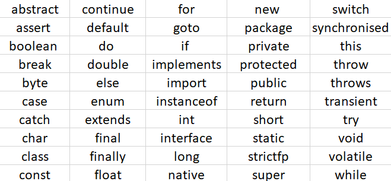

# Variables - Naming Rules
1. Case sensitive
   > `int amount` & `int Amount` both are different, `int amounT` this is also different w.r.t. previous
   > `int x` & `float x` error
   > `int x` & `float X` ok
2. Starts with Alphabets, Numbers, _ or $ [it should not contain any other special characters]
   > Valid - `int room151`, `int room_num`, `float total$amount`
3. Starts with Alphabets, _ or $ [can't start with numbers]
   > Valid - `byte x1`, `byte _x`, `byte $x`
   > Invalid - `byte 1x`
4. Should not be a keyword
   > 
5. Should not be a class name, if class is also in use
6. No limit on length of name
7. Follow Camel Casing
---
+ Java Keywords
  